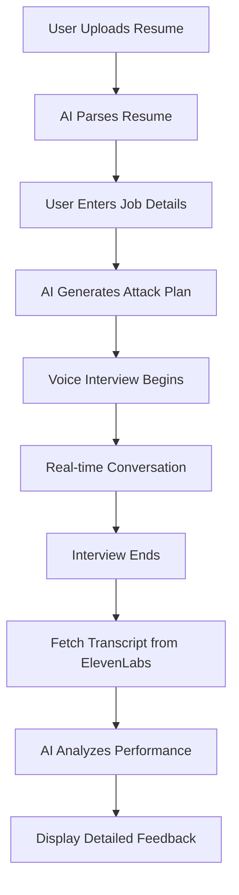

<div align="center">

# GrillMe AI

<em>Master Your Interviews with AI-Driven Confidence</em>

[](https://www.typescriptlang.org/)
[](https://react.dev/)
[](https://vitejs.dev/)
[](LICENSE)

**Built with:** React · TypeScript · Vite · Cloudflare Workers · Hono · OpenAI · ElevenLabs · Supabase

</div>

---

## Table of Contents

- [Overview](#overview)
- [Features](#features)
- [Demo](#demo)
- [Tech Stack](#tech-stack)
- [Getting Started](#getting-started)
  - [Prerequisites](#prerequisites)
  - [Installation](#installation)
  - [Configuration](#configuration)
  - [Running Locally](#running-locally)
- [Architecture](#architecture)
- [Usage](#usage)
- [Testing](#testing)
- [Deployment](#deployment)
- [Contributing](#contributing)
- [License](#license)

---

## Overview

**GrillMe AI** is an AI-powered mock interview platform that helps students and early-career professionals practice job interviews. Unlike generic interview prep tools, GrillMe analyzes your specific resume and target job description to create personalized, voice-based interview simulations with actionable feedback.

### Why GrillMe?

Traditional interview prep falls short because generic questions don't test your specific experience, text-based practice misses the pressure of real-time conversation, and feedback is subjective and delayed.

**GrillMe solves this by:**
- **Personalized Questions** - AI analyzes your resume vs. job requirements to find gaps and probe specific claims
- **Real Voice Interviews** - Practice with natural voice AI that responds in real-time
- **Detailed Feedback** - Get timestamped highlights showing exactly what worked and what didn't
- **Strategic Insights** - Discover buzzwords, vague answers, and missed opportunities with specific improvement suggestions

---

## Features

### Smart Interview Generation
- Upload resume (PDF, DOCX, DOC) with automatic parsing
- Paste job description and select interview type (Technical, Behavioral, or Mixed)
- AI generates an "Attack Plan" with strategic questions targeting your specific experience

### Voice-Based Interviews
- Natural conversation with ElevenLabs AI interviewer
- Real-time audio interaction with dynamic status indicators
- Live transcript display during the interview
- Pause and ask for strategic "lifeline" help mid-interview

### Comprehensive Analysis
- **Overall Performance Score** (1-10) - How well you interviewed
- **Technical Depth Score** (0-100) - Depth of technical knowledge demonstrated
- **BS Detection Score** (0-100) - Amount of buzzwords and vagueness detected

### Timestamped Feedback Highlights
Color-coded moments in your interview:
- **Green** - Excellent answers (specific metrics, STAR method, concrete examples)
- **Yellow** - Warning signs (vague language, missing details, weak structure)
- **Red** - Blunders (buzzword stuffing, evasion, inconsistencies)

### Interview History
- Dashboard of all past interviews
- Audio playback with visual waveform
- Searchable transcript with highlighted feedback
- Track improvement over time

---

## Demo

*Coming soon - demo video showcasing the full interview flow*

---

## Tech Stack

### Frontend
- **React 18.2** with **TypeScript** - Modern UI framework
- **Vite** - Lightning-fast build tool and dev server
- **Tailwind CSS** - Utility-first styling
- **Radix UI** - Accessible component primitives
- **ElevenLabs Conversational AI SDK** - Voice interview integration
- **Lucide React** - Beautiful icon library

### Backend
- **Cloudflare Workers** - Serverless edge runtime
- **Hono** - Ultra-fast web framework
- **Supabase** - PostgreSQL database + authentication
- **OpenAI API** - GPT-4 and GPT-5 for AI reasoning
- **ElevenLabs API** - Voice conversation management

### Key Libraries
- `zod` - Runtime type validation
- `mammoth` - DOCX parsing
- `unpdf` - PDF text extraction
- `react-hook-form` - Form management
- `date-fns` - Date utilities
- `sonner` - Toast notifications

---

## Getting Started

### Prerequisites

Before you begin, ensure you have:

- **Node.js** (v18 or higher)
- **npm** (v9 or higher)
- API keys for:
  - [OpenAI](https://platform.openai.com/api-keys)
  - [ElevenLabs](https://elevenlabs.io/)
  - [Supabase](https://supabase.com/)

### Installation

1. **Clone the repository:**

   ```bash
   git clone https://github.com/peteseta/grill-me.git
   cd grill-me
   ```

2. **Install frontend dependencies:**

   ```bash
   npm install
   ```

3. **Install backend dependencies:**

   ```bash
   cd workers
   npm install
   cd ..
   ```

### Configuration

#### Frontend Environment Variables

Create a `.env` file in the root directory:

```env
VITE_API_URL=http://localhost:8787
VITE_ELEVENLABS_API_KEY=your_elevenlabs_api_key_here
```

#### Backend Secrets (Cloudflare Workers)

Set up your Cloudflare Worker secrets:

```bash
cd workers

# Supabase configuration
wrangler secret put SUPABASE_URL
wrangler secret put SUPABASE_ANON_KEY
wrangler secret put SUPABASE_SERVICE_ROLE_KEY

# AI service keys
wrangler secret put OPENAI_API_KEY
wrangler secret put ELEVENLABS_API_KEY
wrangler secret put ELEVENLABS_AGENT_ID

cd ..
```

#### Database Setup

1. Create a new project on [Supabase](https://supabase.com/)
2. Run the SQL migrations in `workers/migrations/` to set up tables
3. Enable email authentication in Supabase dashboard

### Running Locally

1. **Start the backend server:**

   ```bash
   cd workers
   npm run dev
   ```

   Backend runs on `http://localhost:8787`

2. **In a new terminal, start the frontend:**

   ```bash
   npm run dev
   ```

   Frontend runs on `http://localhost:5173`

3. **Open your browser:**

   Navigate to `http://localhost:5173`

**Note:** Vite's proxy configuration automatically forwards `/api/*` requests to the backend, avoiding CORS issues during development.

---

## Architecture

### Project Structure

```
grill-me/
├── src/                      # Frontend source
│   ├── components/           # React components
│   │   ├── landing-page.tsx
│   │   ├── upload-page.tsx
│   │   ├── interview-page.tsx
│   │   ├── history-page.tsx
│   │   └── ui/              # Reusable UI components
│   ├── lib/                 # Utilities and API client
│   ├── App.tsx              # Main app with routing
│   └── main.tsx             # React entry point
├── workers/                 # Backend (Cloudflare Workers)
│   ├── src/
│   │   ├── index.ts         # Main API router
│   │   ├── routes/          # API endpoint handlers
│   │   │   ├── auth.ts
│   │   │   ├── sessions.ts
│   │   │   ├── analyze.ts
│   │   │   └── lifeline.ts
│   │   ├── services/        # Business logic
│   │   │   ├── resume-parser.ts
│   │   │   ├── attack-plan-generator.ts
│   │   │   ├── interview-analyzer.ts
│   │   │   └── elevenlabs.ts
│   │   └── types/          # TypeScript definitions
│   └── wrangler.toml       # Cloudflare configuration
├── docs/                   # Documentation
└── public/                 # Static assets
```

### Interview Flow



### API Architecture

The backend exposes a RESTful API with the following key endpoints:

| Endpoint | Method | Description |
|----------|--------|-------------|
| `/api/v1/auth/register` | POST | Create new user account |
| `/api/v1/auth/login` | POST | Authenticate user |
| `/api/v1/sessions` | POST | Create interview session |
| `/api/v1/sessions` | GET | List user's interviews |
| `/api/v1/sessions/:id/config` | GET | Get ElevenLabs config |
| `/api/v1/sessions/:id/lifeline` | POST | Get real-time help |
| `/api/v1/sessions/:id/analyze` | POST | Analyze interview |
| `/api/v1/sessions/:id/results` | GET | Retrieve results |

See `docs/API.md` for complete API documentation.

---

## Usage

### Creating Your First Mock Interview

1. **Sign up** or **log in** to your account
2. **Upload your resume** (PDF, DOCX, or DOC format)
3. **Paste the job description** for your target role
4. **Enter role details** (title, company name)
5. **Select interview type:**
   - **Technical** - Focus on technical skills and problem-solving
   - **Behavioral** - Focus on past experiences and soft skills
   - **Mixed** - Combination of both
6. **Click "Start Interview"** and allow microphone access
7. **Talk naturally** with the AI interviewer
8. **End the interview** when ready
9. **Review detailed feedback** with timestamped highlights

### Tips for Best Results

- **Be specific** - Use concrete examples and metrics
- **Use STAR method** - Situation, Task, Action, Result
- **Avoid buzzwords** - Say "implemented caching layer" instead of "leveraged cutting-edge solutions"
- **Speak clearly** - The AI transcription works best with clear audio
- **Use the lifeline** - Pause and ask for help if you're stuck

---

## Testing

### Frontend Tests

```bash
npm run test
```

### Backend Tests

```bash
cd workers
npm run test
```

### Type Checking

```bash
# Frontend
npm run type-check

# Backend
cd workers
npm run type-check
```

---

## Deployment

### Frontend Deployment

Build the production bundle:

```bash
npm run build
```

Deploy the `dist/` folder to your hosting provider (Vercel, Netlify, Cloudflare Pages, etc.).

**Example for Vercel:**

```bash
vercel --prod
```

### Backend Deployment

Deploy the Cloudflare Worker:

```bash
cd workers
npm run deploy
```

Make sure all secrets are configured in your Cloudflare dashboard or via `wrangler secret put`.

---

## Contributing

We welcome contributions! Please follow these steps:

1. **Fork the repository**
2. **Create a feature branch** (`git checkout -b feature/amazing-feature`)
3. **Commit your changes** (`git commit -m 'Add some amazing feature'`)
4. **Push to the branch** (`git push origin feature/amazing-feature`)
5. **Open a Pull Request**

### Development Guidelines

- Write meaningful commit messages
- Follow existing code style (TypeScript, ESLint)
- Add tests for new features
- Update documentation as needed

---

## License

This project is licensed under the MIT License - see the [LICENSE](LICENSE) file for details.

---

## Acknowledgments

- **OpenAI** - For GPT models powering intelligent analysis
- **ElevenLabs** - For natural voice AI conversations
- **Supabase** - For database and authentication
- **Cloudflare** - For serverless edge computing
- **Radix UI** - For accessible component primitives

---

<div align="center">

**Built by the GrillMe team**

[Report Bug](https://github.com/peteseta/grill-me/issues) · [Request Feature](https://github.com/peteseta/grill-me/issues)

</div>
